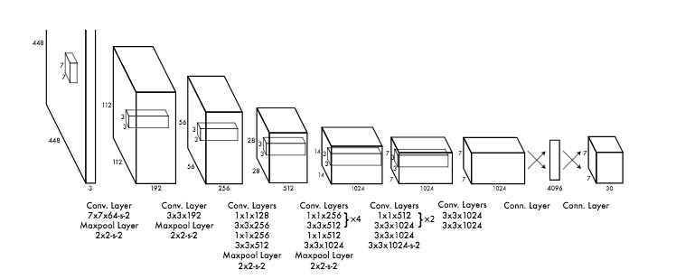

#Yolo v1 Implementation from Scratch
This Repo is an implementation of the Famous Yolo v1 from scratch in an attemp for me to better understand the method. 

Dataset : PASCAL Data with 20 classes


###The architecture of the Yolo Model 
- Implemented in model.py


### Loss Function used for Yolo
- Implemented in loss.py


- train.py : Main Function to train the model
- utils.py : Helper Functions like metrics (mAP,IoU)
- dataset.py :Create the Dataset and Custom DataLoader
###To reproduce the environment 
```python
$  pip install requirements.txt
python train.py
```

OR
 ```python
$ conda create --name <env> --file requirements.txt
python train.py
```
NOTE : I could not train on the full dataset due exceding CUDA Memory in my local machine


